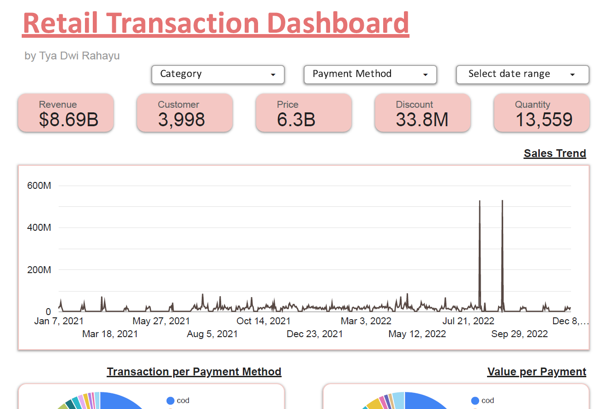
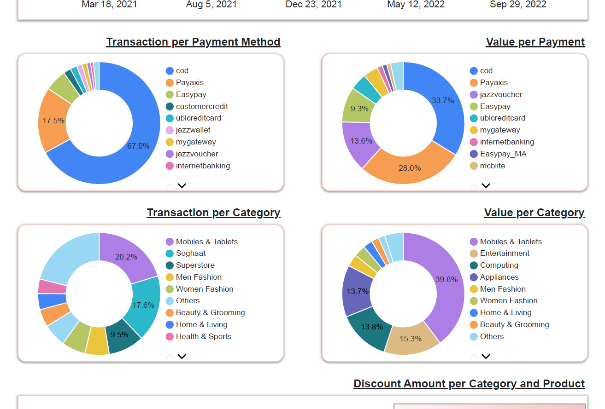
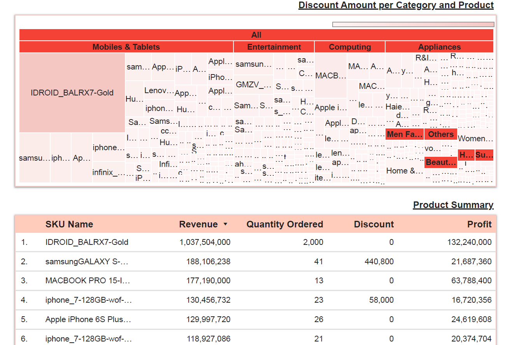
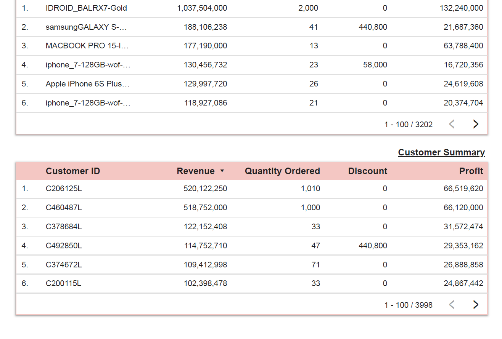

# 📊 Retail Transaction Dashboard (Google Looker Studio)

Dashboard ini dibuat sebagai bagian dari program e-learning Data Analyst oleh MySkill. Proyek ini bertujuan untuk menganalisis performa penjualan ritel melalui visualisasi interaktif menggunakan Google Looker Studio.

## 🎯 Tujuan Proyek

- Menyajikan ringkasan metrik utama dalam transaksi ritel
- Menganalisis performa metode pembayaran, kategori produk, dan pelanggan
- Menyediakan dashboard interaktif sebagai alat bantu pengambilan keputusan bisnis

## 🛠 Tools yang Digunakan

- Google Looker Studio
- Microsoft Excel (untuk sumber dan pengolahan data)
- PDF (untuk dokumentasi dan laporan)

## 📌 Fitur Dashboard

- Ringkasan metrik utama: revenue, quantity, discount, gross price
- Analisis metode pembayaran: total transaction & total value
- Analisis kategori produk & produk dengan revenue tertinggi
- Daftar pelanggan top berdasarkan total transaksi dan revenue

## 🌐 Link Dashboard Online

🔗 [Lihat di Google Looker Studio](https://lookerstudio.google.com/reporting/14a9b945-1043-4e14-a4a6-60d55cee4b91)

## 🖼️ Cuplikan Dashboard

## 📄 File yang Disertakan

- [`Proyek_Portofolio_Retail_Transaction_Report.pdf`](Proyek_Portofolio_Retail_Transaction_Report.pdf) – Laporan ringkasan dan insight visual
- [`Retail_Transaction_Report.pdf`](Retail_Transaction_Report.pdf) – Tampilan dashboard dari Looker Studio pdf ver.
- [`Dataset.xlsx`](Dataset.xlsx) – Raw data

## 👩‍💻 Tentang Saya

Nama saya Tya Dwi Rahayu, seorang lulusan Fisika yang sedang membangun karier di bidang Data & IT.  
Saya terbuka untuk kolaborasi dan terus belajar untuk meningkatkan keterampilan di bidang data analysis.

---

📫 Silakan hubungi saya jika tertarik untuk diskusi atau kolaborasi proyek data lainnya!
